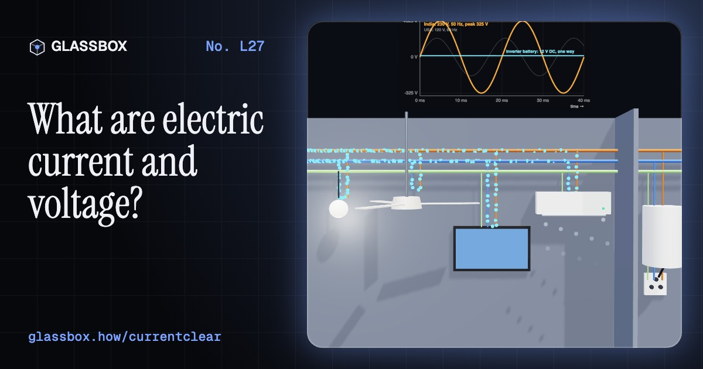
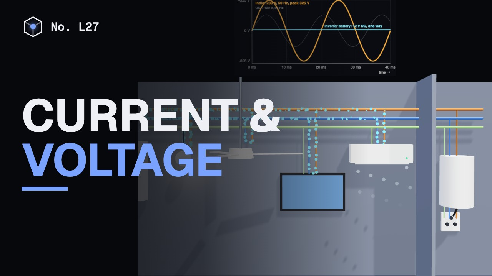
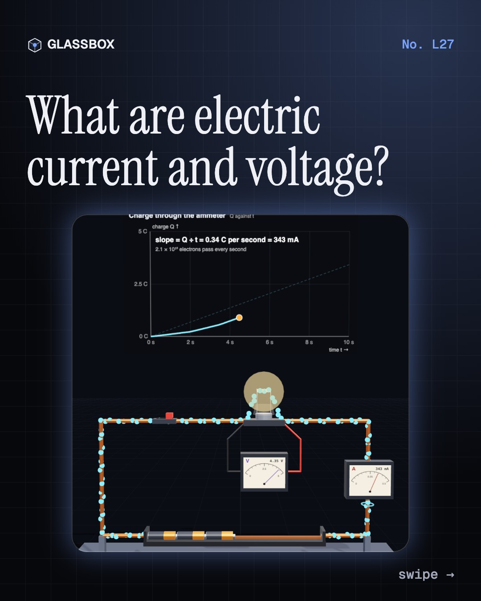
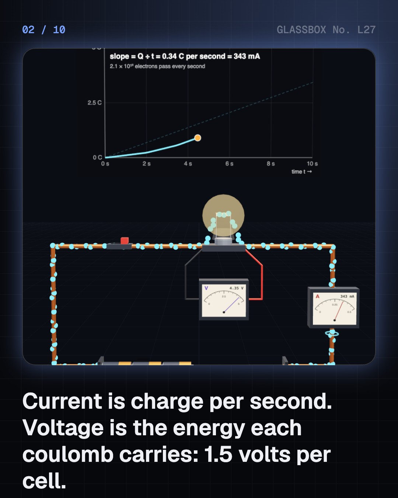
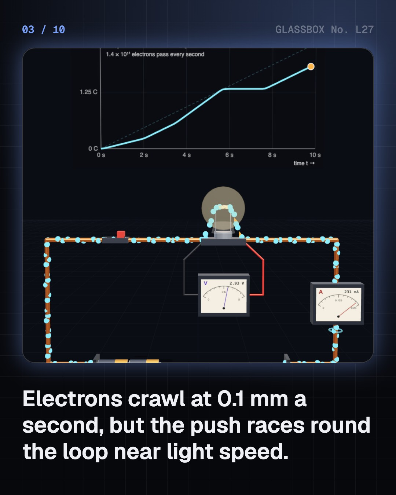
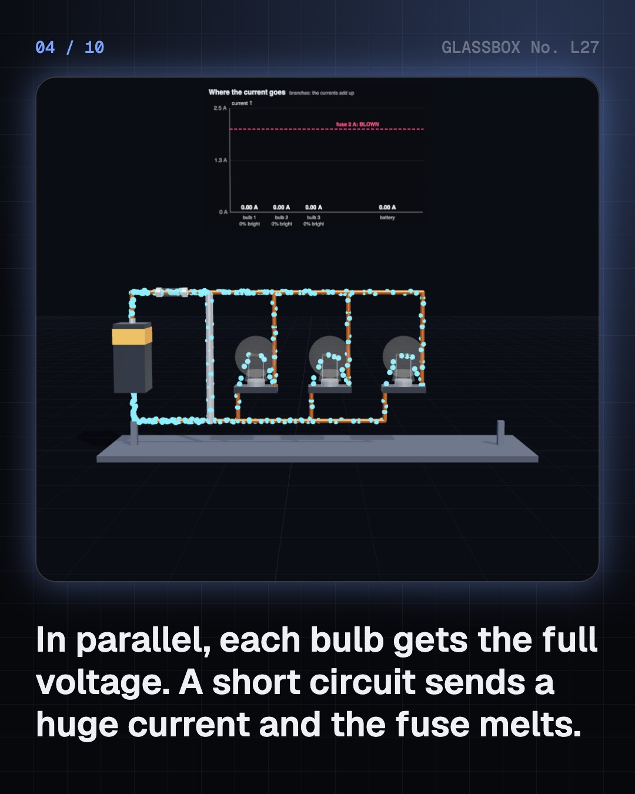

<!-- glassbox:start -->
<!-- Generated from glassbox.json by the Glassbox hub (npm run readme -- currentclear). Edit glassbox.json, not this block. -->
<p align="center"><a href="https://glassbox-production-fd52.up.railway.app/e/currentclear/"></a></p>

<h1 align="center">Electric current and voltage</h1>

<p align="center"><b>What are electric current and voltage?</b><br>Current is a flow of charge, voltage is the push behind it. Build a torch and count the electrons, light fairy lights in series and in parallel, switch on a geyser and an AC in an Indian home, drain a phone and an electric car, and find out why a bird on a wire is safe but wet hands are not.</p>

<p align="center"><a href="https://glassbox-production-fd52.up.railway.app/currentclear/"><b>▶ Play with it</b></a> &nbsp;·&nbsp; <a href="https://glassbox-production-fd52.up.railway.app/e/currentclear/">Read the 60-second explainer</a> &nbsp;·&nbsp; <a href="https://glassbox-production-fd52.up.railway.app/currentclear/glassbox/reel.mp4">Watch the 40-second video</a></p>

<p align="center">
  <a href="https://glassbox-production-fd52.up.railway.app/e/currentclear/"></a>
  <a href="https://glassbox-production-fd52.up.railway.app/e/currentclear/"></a>
  <a href="LICENSE"></a>
  <a href="LICENSE-CONTENT.md"></a>
  <a href="#privacy"></a>
</p>

## In 60 seconds

1. **Flow and push.** Current is charge flowing past a point each second, I = Q ÷ t, in amperes. Voltage is the energy each coulomb carries, in volts. In a torch, electrons crawl at about 0.1 mm/s, but the push races round the loop near light speed, so the bulb lights at once. Diagrams show current from + to −; electrons go the other way.
2. **Series and parallel.** Bulbs in series share the voltage and all go out if one breaks, like old fairy lights. In parallel each gets the full voltage and their currents add up, like the sockets in a house. A fuse melts when the current gets too big, such as in a short circuit.
3. **Home electricity.** Indian mains is 230 V AC at 50 Hz; the US uses 120 V at 60 Hz. Live, neutral and earth wires run to every socket. A fan takes 0.3 A, an AC about 7 A and a geyser 8.7 A, so the geyser needs a 16 A socket. MCBs trip on overload; an RCCB trips when 30 mA leaks to earth.
4. **Batteries and power.** A cell turns chemical energy into electrical energy: 1.5 V for an AA, 3.7 V for lithium-ion, 12 V for six lead-acid cells, nearly 400 V for an EV pack. Energy stored is volts × amp-hours, in watt-hours; power is P = V × I.
5. **Safety and myths.** Current, not voltage alone, harms you: about 1 mA is felt, 10 mA can stop you letting go, 100 mA can kill. Wet skin lets far more through. A bird on one wire is safe. A battery stores chemical energy, not electrons, and higher voltage does not always mean more current.

## Words worth knowing

| Term | Meaning |
|---|---|
| **Electric current** | The rate at which charge flows past a point, I = Q ÷ t, measured in amperes (A). |
| **Voltage** | The energy each coulomb of charge carries, the push that drives current, measured in volts (V = J/C). |
| **Coulomb** | The unit of charge: about 6.24 × 10¹⁸ electrons. One amp is one coulomb per second. |
| **Conventional current** | Current drawn flowing from + to −. Electrons, being negative, drift from − to +. |
| **Series and parallel** | One path shared by every part, or a separate path for each part across the supply. |
| **AC and DC** | Alternating current reverses direction many times a second; direct current flows one way. |
| **Watt-hour** | Energy: volts × amp-hours. 1,000 Wh is 1 kWh, one unit on an electricity bill. |
| **RCCB** | A breaker that cuts the power when 30 mA or more leaks to earth, for example through a person. |

## A short history

**From amber that pulls on feathers to the ampere defined by counting electrons: how people learned what flows in a wire and what pushes it.**

- **600 BCE** · Amber that pulls feathers (Thales of Miletus (attributed), Miletus, Ionia)
- **1600** · Gilbert names it 'electricus' (William Gilbert, London)
- **1747** · Plus and minus (Benjamin Franklin, Philadelphia)
- **1752** · The kite in the storm (Benjamin Franklin, Philadelphia)
- **1800** · The Volta pile: the first battery (Alessandro Volta, Como and Pavia)
- **1820** · Ampère measures current (André-Marie Ampère, Paris)
- **1879** · Electric light in Calcutta (P. W. Fleury & Co., Calcutta (Kolkata))
- **1888** · The war of the currents (Thomas Edison vs George Westinghouse and Nikola Tesla, United States)

The full story, with 23 moments, charts, people and 33 sources: [glassbox.how/e/currentclear/history](https://glassbox-production-fd52.up.railway.app/e/currentclear/history/). The data lives in [`history.json`](history.json).

## Video and slides

Made with the Glassbox studio from this box's storyboard (`window.glassbox.director`). Free to reuse under CC BY 4.0.

<a href="https://glassbox-production-fd52.up.railway.app/currentclear/glassbox/video.mp4"></a>

<p><a href="glassbox/slide-1.jpg"></a> <a href="glassbox/slide-2.jpg"></a> <a href="glassbox/slide-3.jpg"></a> <a href="glassbox/slide-4.jpg"></a></p>

| File | What | Size |
|---|---|---|
| [`glassbox/reel.mp4`](https://glassbox-production-fd52.up.railway.app/currentclear/glassbox/reel.mp4) | Reel / Short, with captions and soundtrack | 1080×1920 |
| [`glassbox/video.mp4`](https://glassbox-production-fd52.up.railway.app/currentclear/glassbox/video.mp4) | YouTube video, with captions and soundtrack | 1920×1080 |
| `glassbox/slide-1…10.jpg` | Instagram carousel | 1080×1350 |
| `glassbox/thumb.jpg` | YouTube thumbnail | 1280×720 |
| `glassbox/cover.jpg` | Share card and repo social preview | 1200×630 |
| [`glassbox/history-reel.mp4`](https://glassbox-production-fd52.up.railway.app/currentclear/glassbox/history-reel.mp4) | “History in 10 moments” Reel / Short | 1080×1920 |
| `glassbox/history-slide-*.jpg` | History carousel | 1080×1350 |
| `glassbox/post.json` | Post copy and schedule used by the publish kit | |

## Privacy

This box has no accounts and no ads, and it ships its own fonts and libraries. When you run it yourself it sends nothing anywhere. On glassbox.how, the site's `/bar.js` also loads Glassbox's analytics: **Google Analytics** to count visits (it asks first in the EU, UK and Switzerland, and stays off when your browser sends Global Privacy Control or Do Not Track) and **ClickTrust** to detect bots.

It remembers a few things **in your own browser only**, and never sends them anywhere:

| Browser storage key | What it holds |
|---|---|
| `currentclear.v1` | Which chapters you have opened, your best quiz scores, and sound on or off. |

Exactly what each one sees is at [glassbox.how/privacy](https://glassbox-production-fd52.up.railway.app/privacy/).

## Licences

- **Code:** [MIT](LICENSE). Use it, change it, ship it.
- **Explanations, text, images and videos** (`glassbox.json`, `glassbox/`): [CC BY 4.0](LICENSE-CONTENT.md). Credit “Glassbox, glassbox.how/e/currentclear”.
- **Third-party parts** keep their own licences: [three.js](https://threejs.org) (MIT), [Geist, Instrument Serif](https://openfontlicense.org) (SIL OFL 1.1).
- The Glassbox name and logo aren't covered by either licence. See the [terms](https://glassbox-production-fd52.up.railway.app/terms/).

Found a mistake? [Open an issue](https://github.com/bdeeps/currentclear/issues). Corrections happen in public.
<!-- glassbox:end -->

## Run it

It's plain HTML, CSS and JavaScript. No build step and no dependencies. Run locally, it contacts no other website.

```bash
python3 -m http.server 8000
```

Three.js and the fonts ship in `vendor/` and `fonts/`, so it also works offline.

Then open http://localhost:8000.

## How it's built

| File | What |
|---|---|
| `index.html`, `css/app.css` | The page and its styles |
| `js/app.js`, `js/stage.js`, `js/ui.js`, `js/kit.js` | The shared Glassbox 3D engine: chapters, 3D stage, controls, quiz, video director |
| `js/current.js` | Shared CurrentClear parts: physics constants, wires and flowing electrons, cells, bulbs, meters, fuse, chart boards |
| `js/chapters/*.js` | One file per chapter: the 3D model, controls, text, key terms, quiz and video scenes |
| `glassbox.json` | Title, question, explainer beats, key terms, browser storage and credits shown on glassbox.how |
| `reel` in each chapter | The storyboard the Glassbox studio records into short videos |
| `glassbox/` | The published video, slides, thumbnail and post copy |
| `fonts/`, `vendor/three/` | Self-hosted Geist and Instrument Serif (SIL OFL 1.1) and three.js (MIT) |
